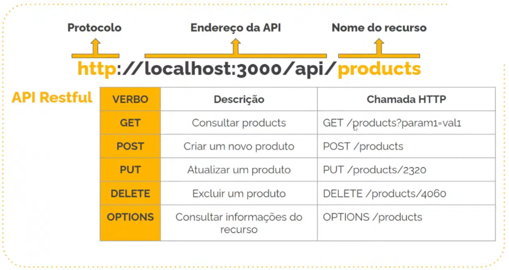

<p align="center">
  <a href="http://nestjs.com/" target="blank"></a>
</p>

<h1 align="center">
🚧 API RESTful com Nestjs | Em Construção 🚧
</h1>

<p align="center">
  

  

  <a href="https://github.com/Douglasproglima/nestjs-docker/commits/main">
    
  </a>

  <a href="https://github.com/Douglasproglima/nestjs-docker/issues">
    
  </a>

  
</p>

<p align="center">
  <a href="#-projeto">Projeto</a>&nbsp;&nbsp;&nbsp;|&nbsp;&nbsp;&nbsp;
  <a href="#-layout">Layout</a>&nbsp;&nbsp;&nbsp;|&nbsp;&nbsp;&nbsp;
  <a href="#rocket-tecnologias">Tecnologias</a>&nbsp;&nbsp;&nbsp;|&nbsp;&nbsp;&nbsp;
  <a href="#rocket-executando">Docker e Docker-compose</a>&nbsp;&nbsp;&nbsp;|&nbsp;&nbsp;&nbsp;
  <a href="#memo-licença">Licença</a>
</p>
<br>

## 💻 Projeto
---

[Nest](https://github.com/nestjs/nest) Simples API cujo objetivo é analisar as funcionalidades básicas e dockerizando a aplicação.

## 🎨 Layout
---


## 🎒 Aprendizados
---

- Framework Nestjs
- Conceitos básicos do framework
- Docker + Containers

## Dockerfile e Docker-compose
---
```bash
# Antes de rodar o comando docker-compose up -docker
# É necessário executar pelo ao menos 1 vez no terminal:
$ chmod +x .docker/entrypoint.sh

# Em seguida execute:
$ docker-compose up -d
```

## Executar
---

```bash
# development
$ npm run start

# watch mode
$ npm run start:dev

# production mode
$ npm run start:prod
```
## Teste
---

```bash
# unit tests
$ npm run test

# e2e tests
$ npm run test:e2e

# test coverage
$ npm run test:cov
```

## License
---

Nest is [MIT licensed](LICENSE).

Feito com ❤️ por Douglas Lima </h2> [Entre em contato!](https://www.linkedin.com/in/douglasproglima)